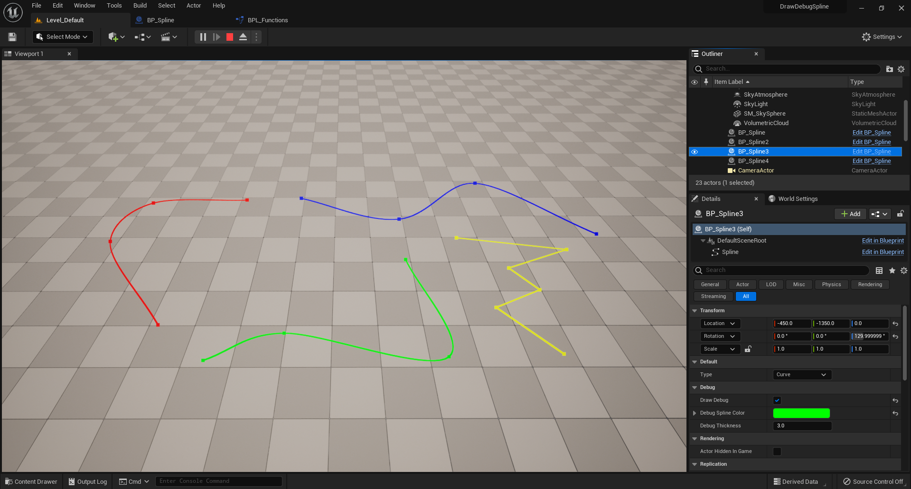
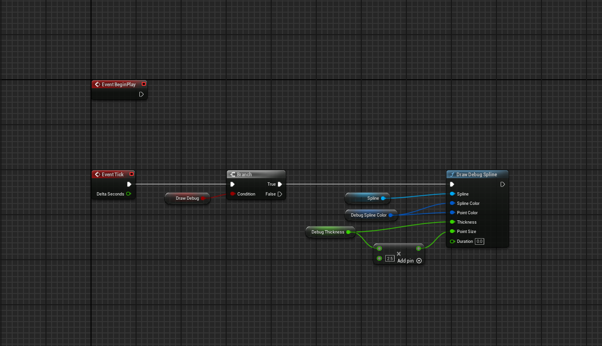

# Draw Debug Spline

A simple debug function node to draw splines individually in Unreal Engine (5.0).\
 \
Big thanks to [YawLighthouse](https://www.youtube.com/@YawLighthouse) for his bezier curves explination [videos](https://youtu.be/-JLTdwCIta4).

 

    
          
    

## License

[MIT](https://choosealicense.com/licenses/mit/)

